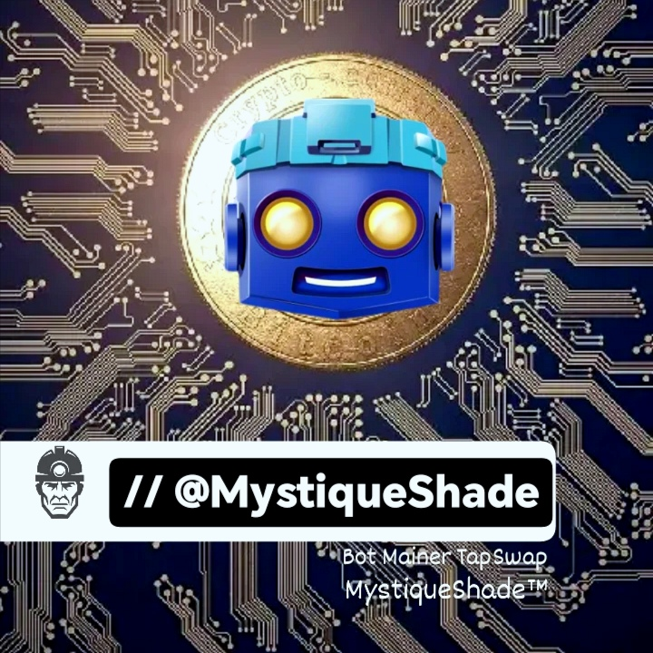
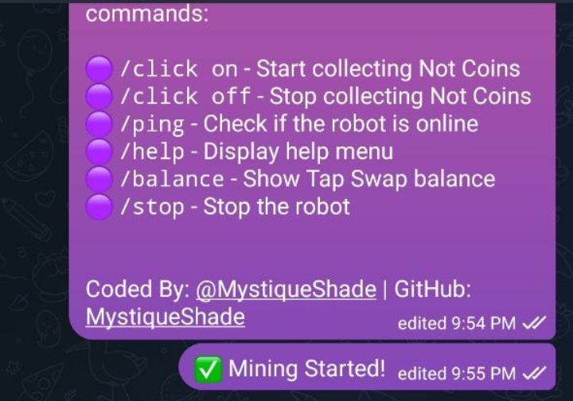

# TapSwap-MinerBot:
>Telegram Bot for 24/7 TapSwap-MinerBot Miner

## Description:
This project is a Telegram bot that provides 24/7 mining capabilities for non-coin cryptocurrencies. Through this bot, users can intelligently and professionally engage in non-coin mining.

# Features:
- 24/7 non-coin mining capability
- Smart algorithms for optimizing mining performance
- Periodic sending of mining performance reports to users
- Support for secure connections to safeguard user information
- Simple and user-friendly interface for easy navigation

## Installation and Usage:
To utilize this bot, users can start by searching for the bot on Telegram and then follow the provided commands to swiftly and effortlessly begin non-coin mining activities.

# License:
This project is released under an [open-source license](https://en.wikipedia.org/wiki/Open-source_license).

---

# نام پروژه:
>ربات تلگرامی برای ماینر  24/7

## توضیحات:
این پروژه یک ربات تلگرامی است که قابلیت ماینینگ بی‌وقفه برای رمزارزهای غیر-سکه‌ای را ارائه می‌دهد. از طریق این ربات، کاربران می‌توانند به صورت هوشمند و حرفه‌ای در عملیات ماینینگ غیر-سکه‌ای مشغول شوند.

# ویژگی‌ها:
- قابلیت ماینینگ غیر-سکه‌ای به صورت 24/7
- الگوریتم‌های هوشمند برای بهینه‌سازی عملکرد ماینینگ
- ارسال دوره‌ای گزارش‌های عملکرد ماینینگ به کاربران
- پشتیبانی از اتصالات امن برای حفاظت از اطلاعات کاربران
- رابط کاربری ساده و کاربرپسند برای دسترسی آسان

## نصب و استفاده:
برای استفاده از این ربات، کاربران می‌توانند با جستجوی ربات در تلگرام و پیروی از دستورات مربوطه، به سرعت و آسانی به فعالیت‌های ماینینگ غیر-سکه‌ای بپردازند.

# لایسنس:
این پروژه تحت یک [لایسنس متن باز](https://en.wikipedia.org/wiki/Open-source_license) منتشر شده است.
---

---

  &nbsp;&nbsp;&nbsp;
  &nbsp;&nbsp;&nbsp;
  

